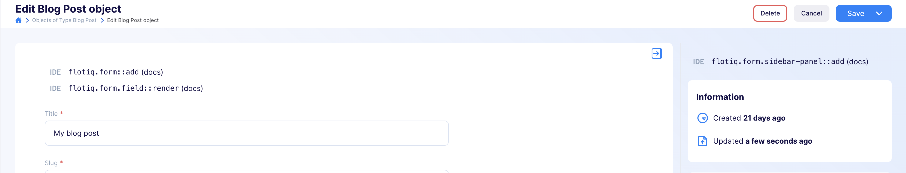
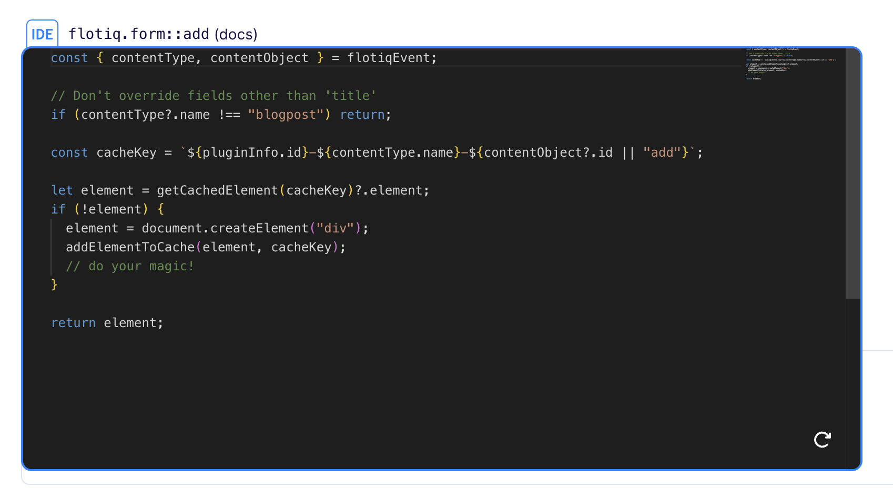
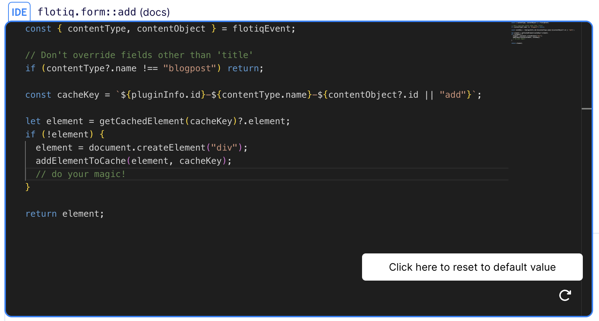
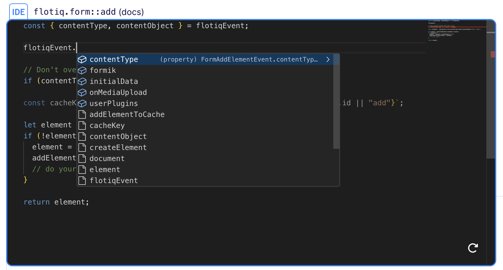
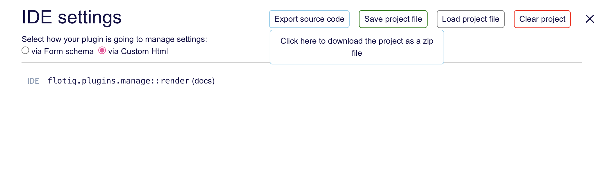

[[_TOC_]]

# Flotiq IDE plugin

This plugin streamlines your workflow by identifying existing events that impact the Flotiq UI, allowing you to code more efficiently.

### Coding

Once you enable the plugin, you’ll notice events on specific pages. These events enable you to modify their appearance.



To manage an event, simply click on its name. You’ll see a code example and a code editor in a popup.



To view the result, either save your changes (using the shortcut Ctrl+S or Command+S) or close the editor by clicking the event name. 

Keep in mind that refreshing the page without saving could lead to data loss.

If you want to revert to the default value, click the reset icon in the editor.



### Available methods

Each event provides hints about the associated data provided by Flotiq.



Available data:
* [`flotiqEvent`](https://flotiq.com/docs/panel/PluginsDevelopment/PluginDocs/5_Events/): Data passed to the event from Flotiq.
* [`globals`](https://flotiq.com/docs/panel/PluginsDevelopment/PluginDocs/4_FlotiqGlobals/): Global variables and methods from Flotiq (e.g., `openSchemaModal`).
* [`client`](https://flotiq.com/docs/panel/PluginsDevelopment/PluginDocs/3_FlotiqApiClient/): Methods for calling the Flotiq API.
* [`window.FlotiqPlugins`](https://flotiq.com/docs/panel/PluginsDevelopment/PluginDocs/0_FlotiqPluginsRegistry/): Flotiq plugins registry.
* cache methods: 
   - `addElementToCache`: Add an HTML element to the cache using a unique cache key.
   - `getCachedElement`: Retrieve an element from the cache by providing a unique cache element key.
* `registerFn`: Register an event to the Flotiq.

### Exporting Your Project

After coding, you can export your plugin’s source code and add it to Flotiq. Click `Export source code` in the manage modal.



Other options in the modal include:
* `Save project file`: Export the project as JSON.
* `Load project file`: Load a project from JSON format.
* `Clear project`: Remove code from all events.

# Development

## Quick start

1. `yarn` - to install dependencies
2. `yarn start` - to start development mode - rebuild on file modifications
3. update your `plugin-manifest.json` file to contain the production URL and other plugin information
4. `yarn build` - to build plugins

## Dev environment

Dev environment is configured to use:

* `prettier` - best used with automatic format on save in IDE
* `eslint` - it is built into both `start` and `build` commands

## Output

The plugins are built into a single `dist/index.js` file. The manifest is copied to `dist/plugin-manifest.json` file.

## Deployment

<!-- TO DO -->

## Loading the plugin

**Warning:** While developing, you can use  `https://localhost:3053/plugin-manifest.json` address to load the plugin manifest. Make sure your browser trusts the local certificate on the latter, to be able to use it e.g. with `https://editor.flotiq.com`

### URL

**Hint**: You can use localhost url from development mode `https://localhost:3053/index.js`

1. Open Flotiq editor
2. Open Chrome Dev console
3. Execute the following script
   ```javascript
   FlotiqPlugins.loadPlugin('plugin-id', '<URL TO COMPILED JS>')
   ```
4. Navigate to the view that is modified by the plugin

### Directly

1. Open Flotiq editor
2. Open Chrome Dev console
3. Paste the content of `dist/index.js` 
4. Navigate to the view that is modified by the plugin

### Deployment

**Hint**: You can use localhost url from development mode `https://localhost:3053/plugin-manifest.json`

1. Open Flotiq editor
2. Add a new plugin and paste the URL to the hosted `plugin-manifest.json` file
3. Navigate to the view that is modified by the plugin
